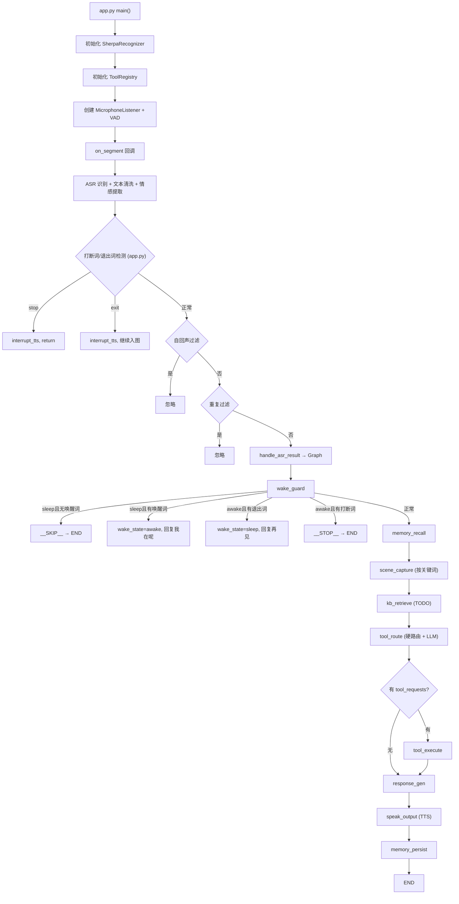

# Robot Agent 智能体核心框架 🤖

欢迎来到 `robot-agent` 项目！本项目是一个基于 [LangGraph](https://python.langchain.com/docs/langgraph) 构建的高可用、解耦合、模块化多模态机器人智能体架构。

## ✨ 项目功能 (Features)
- **多模态全链路感知**：系统实现了离线 ASR（具备音量 VAD 与自动断句的 Sherpa-ONNX 服务）、大语言模型（含多模态看图理解的 LangChain 抽象）和低延迟流式 TTS（如 Minimax）的链路对接。
- **业务工作流可编排化**：放弃了意大利面条式的臃肿代码，利用 LangGraph 图结构将机器人思考流转抽象为“有向无环图”状态机，轻松实现如“唤醒拦截、记忆提取、场景捕获、知识召回、工具调度”的精确调度。
- **用户长短期记忆系统**：支持会话级别的短记忆追溯与利用数据库（Chroma/SQLite）存储及检索用户画像。机器人能够记住用户的习惯与喜好。
- **大模型 Function Calling (Tools) 系统**：内置了一套完善并对 LLM 极其友好的工具注册中心，模型可由此主动决断去执行“查天气”、“系统休眠记录”、“开启声音克隆配置”等动作操作。
- **硬件与算法物理隔离**：系统严密控制依赖树，外接物理设备（麦克风、相机）等驱动死卡在接口层，防止大模型逻辑直接包含操作系统级特定的库环境。

---

## 🔄 项目流程 (LangGraph Workflow)

系统从“应用启动”到“完整的一次交互循环”可以用以下运行拓扑图表示：

**运行阶段解析：**
1. **初始化层 (`app.py main`)**：完成模型加载配置（Sherpa ASR）、工具注册（ToolRegistry），以及开启声音监听线程（MicrophoneListener）。
2. **边缘计算层 (`on_segment`)**：音频分段后，首先完成离线 ASR 识别及打断/退出词检测、自回声处理与重词滤除。处理干净的文本将被送入核心大脑中枢。
3. **Graph 主脑处理层 (`Graph`)**：通过定义好的图状控制流（如上图下方），系统依次实现唤醒态保活(`wake_guard`)、调用记忆(`memory_recall`)、通过 LLM 规划与功能执行(`tool_route`与`tool_execute`)、文本生成(`response_gen`)，并在最后分发播报(`speak_output`)与状态落盘(`memory_persist`)。

---

## 📂 核心目录与内部文档字典 (Structure & Internal Docs)

项目严格遵循“高内聚低耦合”的模块化设计，每个核心目录都配套了针对性的二开指南。**强烈建议在开发相应模块前，先查阅并熟悉对应的内附规范文档**：

* 🚀 **[src/robot_agent/bootstrap](src/robot_agent/bootstrap/README.md) (启动与基建引导层)**
  包含系统起飞前必须就绪的基础设施：结构化日志处理器（`structlog` 的彩色或JSON输出器）、外部附属进程管理（如 ROS 相机节点的生命周期管理）等。
* 🧠 **[src/robot_agent/graph](src/robot_agent/graph/README.md) (中枢神经与工作流层)**
  系统大脑的心智网络。包含了所有的 Agent 状态机“思考节点”和数据总线 `AgentState`，主要控制执行的顺序、跳过截断（Should Skip）逻辑。
* 🛠️ **[src/robot_agent/capabilities](src/robot_agent/capabilities/README.md) (核心算法与模型能力基座)**
  系统所依赖的重度 AI 能力与算力封装区！例如：对特定 ASR 离线模型的包装加载、对流式 TTS WebSocket 网络的封皮、对语言与视觉模型的客户端参数配置校验等。
* 🔌 **[src/robot_agent/interfaces](src/robot_agent/interfaces/README.md) (硬件感官与协议边界)**
  面向真实物理设备的出入口。封装本地系统的各个麦克风流式驱动（VAD音频分割）、喇叭设备名称跨系统查寻工具等，阻止脏数据和底层特定系统环境入侵上层。
* 🔧 **[src/robot_agent/tools](src/robot_agent/tools/README.md) (大模型功能被动调用箱)**
  系统暴露给大语言模型，允许它“根据自己意愿”自动调配的 Function Calling 工具合辑中心（诸如：问时间、记备忘录、使系统挂起休眠）。

*(关于项目的环境与基础启动脚本见根目录相关 `sh` 或 `requirements.txt`。)*

---

## 🐛 如何 Debug (调试指南)

1. **依赖结构化日志追踪 (Structlog)**：
   开发期间推荐关注控制台产生的彩色流式日志信息。系统利用了 `logging.py` 注入进程池上下文，意味着每条日志都会携带当前的 `session_id`、耗时等。你可以清晰地观察到数据被哪个模块卡住。
2. **监控 Graph 的流转切片 (AgentState)**：
   由于核心架构是基于 LangGraph 图计算执行，你能在终端中追踪到它从一个 Node 跳跃到下个 Node 的时间线。若发现机器人“发了疯答非所问”，可在 `response_gen` 节点附近通过打印 `state.normalized_text` 看看是否是 ASR 传来的数据带乱码；或观测 `state.tool_results` 看看传给模型的参数对不对。
3. **查阅系统硬件配置与环境阻挡**：
   大部分启动无反应的问题来源于 `portaudio` 和声卡的缺失异常。可单独测试运行 `interfaces` 中的设备脚本来解决声卡寻找、多麦克风 index 漂移等问题（也可确认 `configs/app.yaml` 文件中的对应音频配置）。

---

## 🏗️ 如何二次开发 (二开指南速查)

该项目的二开被设计得异常分离且规范：
* **我想加一个类似“查询今天汇率”的功能** ➔ **只需去 [Tools](src/robot_agent/tools/README.md) 模块！** 编写异步函数实现功能并以准确的 JSON 参数将其注册抛出给 LLM。
* **公司换了一起科大讯飞/百度的TTS服务** ➔ **只需去 [Capabilities](src/robot_agent/capabilities/README.md) 模块！** 在 `tts/` 新建继承类提供 Adapter 管线接入流，并在此切换配置引用即可，上层状态机全程无感。
* **我想在它说话之前增加一个“敏感内容审核”的过滤步** ➔ **只需去 [Graph](src/robot_agent/graph/README.md) 模块！** 写好 `sensitive_filter.py` Node，修改 `agent_graph.py` 连接线，让执行流切进过滤节点。
* **我想给机器人接管底盘电机的运动** ➔ **只需去 [Interfaces](src/robot_agent/interfaces/README.md) 模块！** 创建 `chassis(底盘)` 的特定库调用，对外暴露如 `move_forward` 方法，上游就可以随便组合驱动物理硬件并保障代码干净。