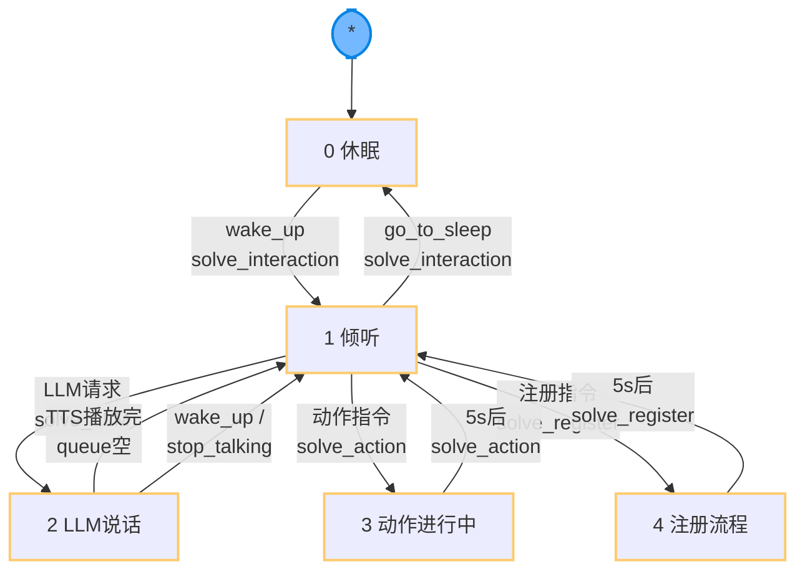

ASR 地址
https://github.com/FunAudioLLM/SenseVoice

使用方法
recognizer=None
def initSherpaOnnx():
    global recognizer
     # 使用 sherpa-onnx 加载量化后的 SenseVoice 模型
    print("正在加载 Sherpa-ONNX SenseVoice 模型...")
    try:
        model_dir = "sherpa-onnx-sense-voice-zh-en-ja-ko-yue-2024-07-17"
        model_path = os.path.join(model_dir, "model_quant.onnx")
        tokens_path = os.path.join(model_dir, "tokens.txt")
        
        # 检查模型文件是否存在，如果不存在则尝试使用默认名称
        if not os.path.exists(model_path):
             model_path = os.path.join(model_dir, "model.onnx")
             
        if not os.path.exists(model_path) or not os.path.exists(tokens_path):
            print(f"Error: Model files not found in {model_dir}")
            print("Please ensure model_quant.onnx (or model.onnx) and tokens.txt exist.")
            return None

        recognizer = sherpa_onnx.OfflineRecognizer.from_sense_voice(
            model=model_path,
            tokens=tokens_path,
            use_itn=True,
            debug=False,
        )
        print("Sherpa-ONNX SenseVoice 模型加载成功")
    except Exception as e:
        print(f"Sherpa-ONNX 模型加载失败: {e}")
        return None
    return True
def useASR_science_voice(audio_data):
      # 使用模型进行识别
    asr1 = time.time()
    # cpu_start = get_cpu_usage()
    print(f"[时间戳] ASR开始: {asr1}")
    raw_text = ""                 
    try:
        stream = recognizer.create_stream()
        stream.accept_waveform(16000, audio_data)
        recognizer.decode_stream(stream)
        raw_text = stream.result.text
    except Exception as e:
        print(f"ASR识别出错: {e}")
        asr2 = time.time()
        # cpu_end = get_cpu_usage()
        print(f"[时间戳] ASR结束: {asr2}")
        print(f"[时间戳] ASR识别时长: {asr2 - asr1}")
        # print_cpu_usage("ASR识别", cpu_start, cpu_end)
    return raw_text